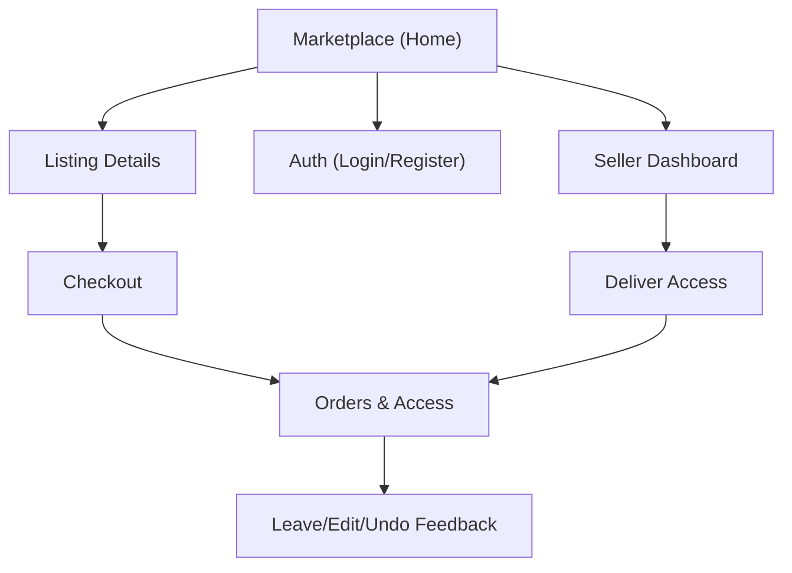

## 1. Product Overview

A marketplace for listing and buying digital accounts/services with post-purchase access delivery.
Buyers receive credentials/instructions in their Orders page, and their feedback drives seller/listing reputation.

## 2. Core Features

### 2.1 User Roles

| Role             | Registration Method                  | Core Permissions                                                                                               |
| ---------------- | ------------------------------------ | -------------------------------------------------------------------------------------------------------------- |
| Buyer            | Email/password registration          | Browse listings, place orders, view delivered access, leave/edit/undo feedback (rules below)                   |
| Seller           | Same as Buyer (toggle “Seller mode”) | Create/manage listings, attach delivery instructions/credentials, view orders for own listings, see reputation |
| Admin (optional) | Internal account                     | Moderate listings/feedback; handle disputes/manual corrections                                                 |

### 2.2 Feature Module

Our requirements consist of the following main pages:

1. **Marketplace (Home)**: browse/search listings, view seller score, entry to auth and orders.
2. **Listing Details**: view full offer details, delivery expectations preview, seller info/score, purchase CTA.
3. **Checkout**: confirm purchase, accept terms, place order.
4. **Orders & Access**: list orders, open order details, reveal delivered credentials/instructions, download attachments, leave/edit/undo feedback.
5. **Seller Dashboard**: create/edit listings, manage delivery content, view order list, view reputation and feedback.
6. **Auth (Login/Register)**: login, registration, password reset.

### 2.3 Page Details

| Page Name             | Module Name              | Feature description                                                                                                                                        |
| --------------------- | ------------------------ | ---------------------------------------------------------------------------------------------------------------------------------------------------------- |
| Marketplace (Home)    | Listing discovery        | Browse and search listings; filter/sort; show price, delivery type, and seller score (or “New” when score=0).                                              |
| Marketplace (Home)    | Entry points             | Navigate to Listing Details, Auth, and Orders.                                                                                                             |
| Listing Details       | Offer information        | Show title, description, inclusions, constraints, and delivery expectations (what buyer receives).                                                         |
| Listing Details       | Seller summary           | Show seller name, current reputation score, feedback count, and “New seller” state when score=0.                                                           |
| Listing Details       | Purchase CTA             | Start checkout for this listing.                                                                                                                           |
| Checkout              | Order creation           | Confirm listing, quantity (if applicable), buyer notes (optional), and create order.                                                                       |
| Checkout              | Terms                    | Require confirmation that digital access delivery is non-refundable unless invalid/not delivered (text-only acknowledgement).                              |
| Orders & Access       | Order list               | Show order status (Processing/Delivered), purchase date, and link to details.                                                                              |
| Orders & Access       | Access delivery          | Reveal delivered credentials/instructions; show “copy” actions; show any attached files; show delivery timestamp.                                          |
| Orders & Access       | Issue handling (MVP)     | Allow buyer to mark “Not delivered/Invalid” to open a visible issue flag for seller/admin review.                                                          |
| Orders & Access       | Feedback                 | Allow buyer to submit rating + comment after delivery; compute listing + seller reputation from eligible feedback.                                         |
| Orders & Access       | Feedback edit/undo rules | Allow edit within 15 minutes of first submission; allow undo (delete) within 60 minutes; after that feedback is locked and remains visible for reputation. |
| Seller Dashboard      | Listing management       | Create/edit/unpublish listings; set price, description, delivery method, and expected delivery time.                                                       |
| Seller Dashboard      | Delivery content         | Attach per-listing delivery instructions template and/or upload per-order credentials payload; confirm delivery to mark order Delivered.                   |
| Seller Dashboard      | Order management         | View orders for own listings; deliver access; view buyer issue flags.                                                                                      |
| Seller Dashboard      | Reputation view          | Show seller score trend, feedback list, and breakdown by listing.                                                                                          |
| Auth (Login/Register) | Authentication           | Register, login, logout, and password reset.                                                                                                               |

## 3. Core Process

**Buyer flow**

1. Browse Marketplace and open a Listing Details page.
2. Review offer + seller score; proceed to Checkout.
3. Place an order.
4. When the seller delivers, open Orders & Access and reveal credentials/instructions.
5. Leave feedback; optionally edit within 15 minutes or undo within 60 minutes.

**Seller flow**

1. Enable Seller mode and create a listing.
2. When an order arrives, deliver access by entering credentials/instructions (and optional files).
3. Monitor issues and reputation changes from buyer feedback.

**Reputation rules**

* New seller starts at **0.0** score and is labeled **“New”** until the first non-undone feedback exists.

* Seller score and listing score are derived from the average of locked + currently-active feedback (edits update score; undo removes it).

