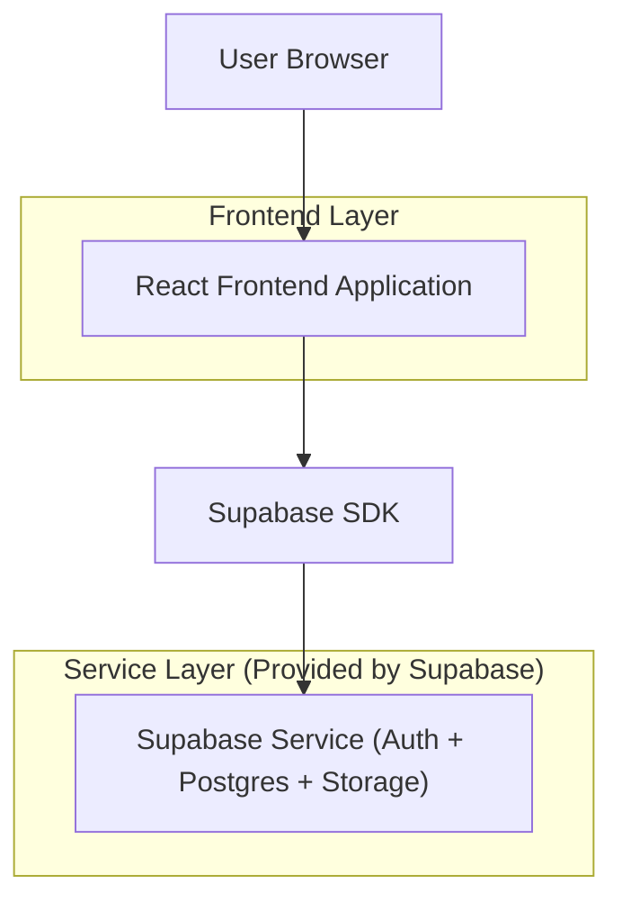
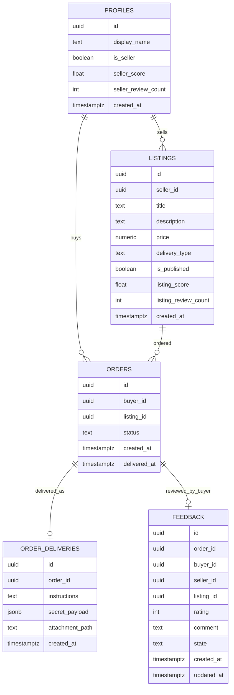

## 1.Architecture design


## 2.Technology Description
- Frontend: React@18 + vite + tailwindcss@3
- Backend: Supabase (Auth, Postgres, Storage)

## 3.Route definitions
| Route | Purpose |
|-------|---------|
| / | Marketplace home (browse/search listings) |
| /listing/:id | Listing details + seller summary + purchase CTA |
| /checkout/:listingId | Place order + terms acknowledgement |
| /orders | Buyer order list |
| /orders/:orderId | Order details + access reveal + feedback create/edit/undo |
| /seller | Seller dashboard (listings, orders, delivery, reputation) |
| /auth | Login/register/reset password |

## 6.Data model(if applicable)

### 6.1 Data model definition


### 6.2 Data Definition Language
Notes:
- Use RLS so only the buyer of an order can read its delivery + feedback; only the seller can write delivery for their orders.
- Keep “foreign keys” logical (uuid columns) to avoid hard DB constraints early.

Profiles (profiles)
```sql
CREATE TABLE profiles (
  id uuid PRIMARY KEY,
  display_name text NOT NULL,
  is_seller boolean NOT NULL DEFAULT false,
  seller_score double precision NOT NULL DEFAULT 0,
  seller_review_count int NOT NULL DEFAULT 0,
  created_at timestamptz NOT NULL DEFAULT now()
);
GRANT SELECT ON profiles TO anon;
GRANT ALL PRIVILEGES ON profiles TO authenticated;
```

Listings (listings)
```sql
CREATE TABLE listings (
  id uuid PRIMARY KEY DEFAULT gen_random_uuid(),
  seller_id uuid NOT NULL,
  title text NOT NULL,
  description text NOT NULL,
  price numeric(10,2) NOT NULL,
  delivery_type text NOT NULL,
  is_published boolean NOT NULL DEFAULT false,
  listing_score double precision NOT NULL DEFAULT 0,
  listing_review_count int NOT NULL DEFAULT 0,
  created_at timestamptz NOT NULL DEFAULT now()
);
GRANT SELECT ON listings TO anon;
GRANT ALL PRIVILEGES ON listings TO authenticated;
```

Orders (orders)
```sql
CREATE TABLE orders (
  id uuid PRIMARY KEY DEFAULT gen_random_uuid(),
  buyer_id uuid NOT NULL,
  listing_id uuid NOT NULL,
  status text NOT NULL DEFAULT 'processing',
  created_at timestamptz NOT NULL DEFAULT now(),
  delivered_at timestamptz
);
GRANT ALL PRIVILEGES ON orders TO authenticated;
```

Order deliveries (order_deliveries)
```sql
CREATE TABLE order_deliveries (
  id uuid PRIMARY KEY DEFAULT gen_random_uuid(),
  order_id uuid NOT NULL,
  instructions text NOT NULL,
  secret_payload jsonb,
  attachment_path text,
  created_at timestamptz NOT NULL DEFAULT now()
);
GRANT ALL PRIVILEGES ON order_deliveries TO authenticated;
```

Feedback (feedback)
```sql
CREATE TABLE feedback (
  id uuid PRIMARY KEY DEFAULT gen_random_uuid(),
  order_id uuid NOT NULL,
  buyer_id uuid NOT NULL,
  seller_id uuid NOT NULL,
  listing_id uuid NOT NULL,
  rating int NOT NULL,
  comment text,
  state text NOT NULL DEFAULT 'active',
  created_at timestamptz NOT NULL DEFAULT now(),
  updated_at timestamptz NOT NULL DEFAULT now()
);
CREATE INDEX idx_feedback_seller_id ON feedback(seller_id);
CREATE INDEX idx_feedback_listing_id ON feedback(listing_id);
GRANT ALL PRIVILEGES ON feedback TO authenticated;
```

Reputation computation (app-side, MVP)
- Display **0.0 + “New”** when review_count = 0.
- Otherwise show avg(rating) over feedback.state='active' for seller_id/listing_id.

Feedback edit/undo enforcement (app-side + optional DB checks)
- Store timestamps; block edits after 15 minutes from first create.
- Allow undo (set state='undone') until 60 minutes from first create.
- After lock, feedback remains readable and impacts reputation unless undone within the window.