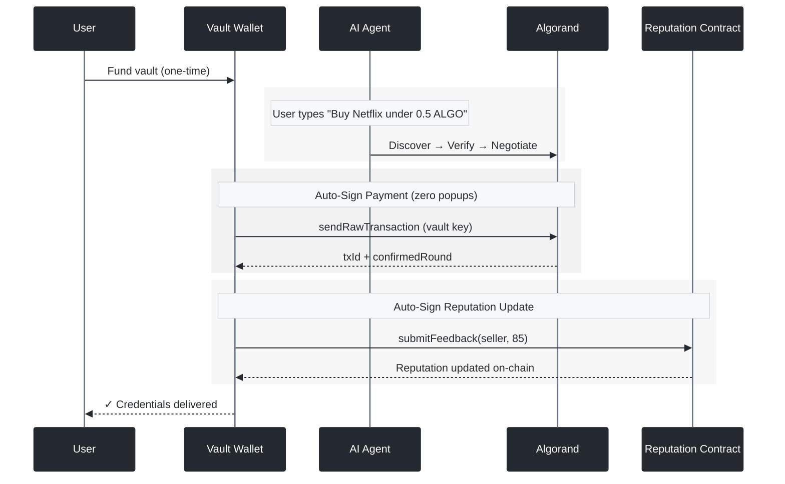
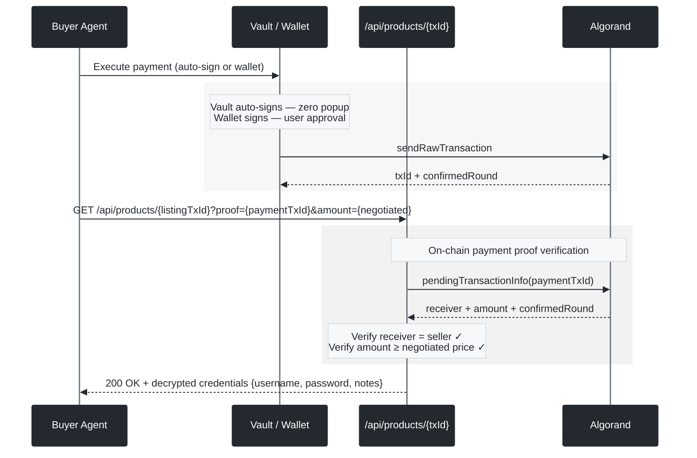
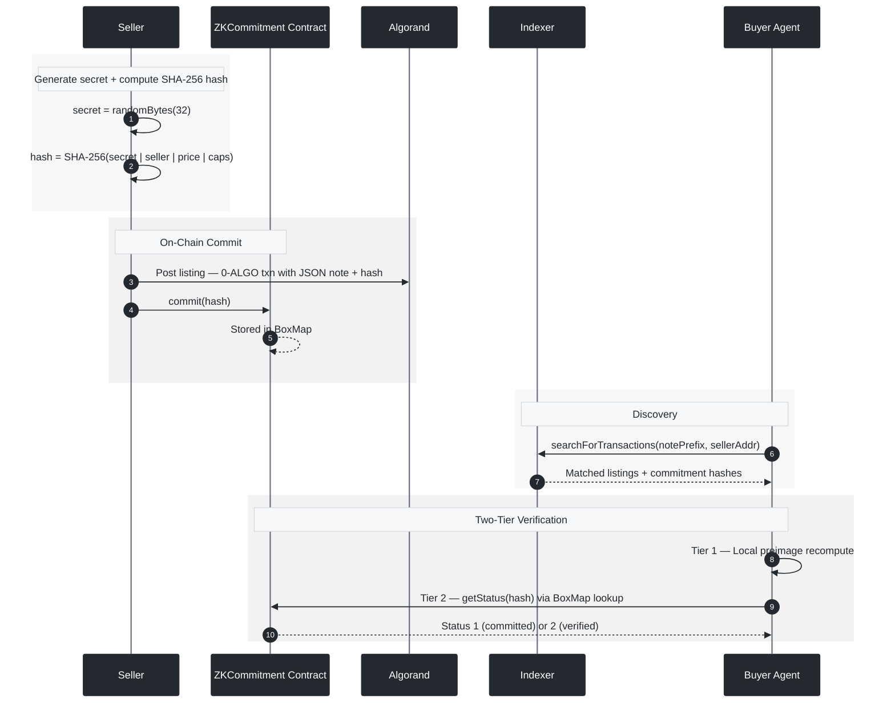
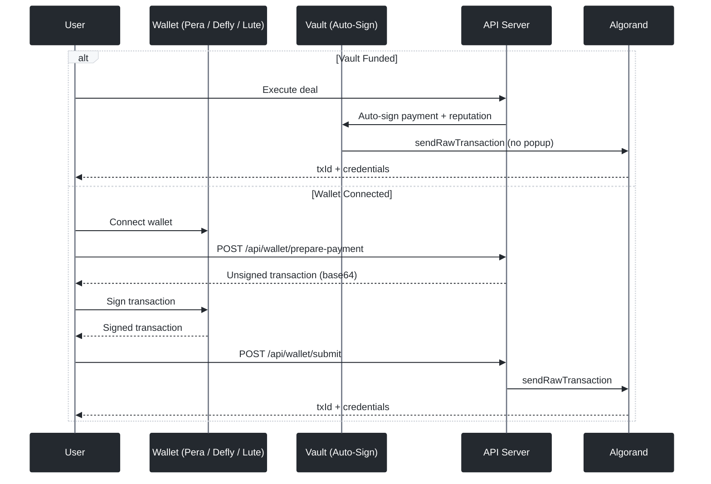
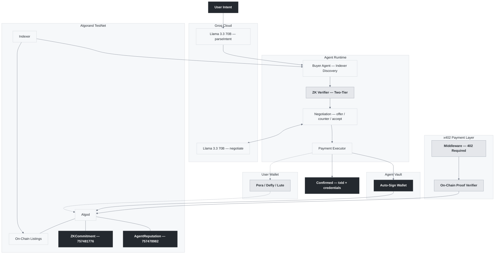

<div align="center">

<br/>

<picture>
  <source media="(prefers-color-scheme: dark)" srcset="https://img.shields.io/badge/A2A-Agentic_Commerce-white?style=for-the-badge&labelColor=000000">
  
</picture>

<br/><br/>

# Autonomous Agents. On-Chain Verification. Real Payments.

<br/>

AI agents autonomously discover services on the Algorand blockchain, negotiate prices with LLMs,<br/>
execute payments through the x402 protocol, verify sellers via on-chain ZK commitments,<br/>
and deliver encrypted credentials to buyers — all without a single human click.<br/>
**Zero intervention. Real credentials. On-chain everything.**

<br/>

<p>
  <a href="https://lora.algokit.io/testnet/application/757481776"></a>
  &nbsp;&nbsp;
  <a href="https://lora.algokit.io/testnet/application/757478982"></a>
</p>

<p>
  
  
  
  
  
  
  
</p>

<br/>

---

</div>

<br/>

## Overview

Every digital purchase today — cloud storage, API access, compute, streaming accounts — requires a human to search, compare, and pay. **A2A Agentic Commerce** removes that bottleneck entirely. Fund the Vault, type what you want, and autonomous agents handle discovery, verification, negotiation, payment, and credential delivery end-to-end.

```mermaid
%%{init: {'theme': 'base', 'themeVariables': {'primaryColor': '#24292f', 'primaryTextColor': '#24292f', 'primaryBorderColor': '#d1d5db', 'lineColor': '#6b7280', 'secondaryColor': '#f6f8fa', 'tertiaryColor': '#f6f8fa', 'background': '#ffffff', 'mainBkg': '#f6f8fa', 'nodeBorder': '#d1d5db', 'clusterBkg': '#f6f8fa', 'clusterBorder': '#d1d5db', 'titleColor': '#24292f', 'edgeLabelBackground': '#ffffff', 'textColor': '#24292f'}}}%%

flowchart LR
    A["<b>User Intent</b><br/><i>Natural language</i>"]:::node
    B["<b>AI Parse</b><br/><i>Groq Llama 3.3</i>"]:::node
    C["<b>Discover</b><br/><i>Algorand Indexer</i>"]:::node
    D["<b>ZK Verify</b><br/><i>On-chain SHA-256</i>"]:::accent
    E["<b>Negotiate</b><br/><i>Reputation-aware</i>"]:::node
    F["<b>Vault Pay</b><br/><i>x402 Auto-Sign</i>"]:::accent
    G["<b>Credentials</b><br/><i>Encrypted delivery</i>"]:::accent

    A --> B --> C --> D --> E --> F --> G

    classDef node fill:#f6f8fa,stroke:#d1d5db,color:#24292f,font-size:13px
    classDef accent fill:#24292f,stroke:#24292f,color:#ffffff,font-size:13px
```



<br/>

---

<br/>

## What Makes This Different

<table>
<tr>
<td width="20%" align="center">

**x402 Protocol**

Full x402 HTTP payment integration. Agents pay for credentials via 402 responses — signless, on-chain verified, no external facilitator dependency. Payment proof checked directly against the Algorand ledger.

</td>
<td width="20%" align="center">

**Agent Vault**

Fund once, sit back. The Vault wallet auto-signs payments, reputation updates, and ZK verifications on behalf of AI agents — zero wallet popups. Fully autonomous commerce.

</td>
<td width="20%" align="center">

**On-Chain ZK**

SHA-256 commit-reveal-verify runs inside the AVM via a [deployed contract](https://lora.algokit.io/testnet/application/757481776). The blockchain enforces the proof, not client JavaScript.

</td>
<td width="20%" align="center">

**Wallet-Native**

Pera, Defly, Lute. Server builds unsigned txns, wallet signs client-side. Private keys never touch the server. Or skip wallets entirely — let the Vault handle it.

</td>
<td width="20%" align="center">

**Encrypted Credentials**

Sellers provide username + password when listing. AES-256-GCM encrypted at rest. Delivered to buyers only after x402 payment proof is verified on-chain.

</td>
</tr>
</table>

<br/>

---

<br/>

## Agent Vault — Autonomous Payments

The Vault is the key to fully autonomous agent commerce. It's a server-managed wallet that AI agents auto-sign from — users fund it once, and agents handle everything from there. No popups, no approvals, no friction.



<br/>

| Mode                  | How it works                           | Wallet popup? |
| :-------------------- | :------------------------------------- | :-----------: |
| **Vault (preferred)** | Server auto-signs with vault key       |    **No**     |
| **Wallet**            | Pera / Defly / Lute signs client-side  |      Yes      |
| **Server-side**       | Uses `AVM_PRIVATE_KEY` (signless x402) |    **No**     |

> Payment execution priority: **Vault → Wallet → Server-side**. If the Vault is funded, agents always auto-sign.

<br/>

---

<br/>

## Live Smart Contracts

> Both contracts are deployed and actively used on Algorand TestNet. Every purchase triggers real-time transactions — ZK verification and reputation updates hit the chain with every deal.

<br/>

<table>
<tr>
<td width="50%">

### [`ZKCommitment`](https://lora.algokit.io/testnet/application/757481776) &nbsp; `App 757481776`

On-chain commit-reveal-verify scheme. The AVM's native `sha256` opcode recomputes hashes and asserts correctness — trustless verification enforced at the protocol level. Used in real-time during negotiations.

```
commit(hash)            → Store SHA-256 hash in BoxMap
reveal(hash, preimage)  → AVM runs sha256(preimage), asserts match
getStatus(hash)         → 0: not found | 1: committed | 2: verified
```

<sub>
<a href="contracts/ZKCommitment.algo.ts">View Source</a> · <a href="contracts/artifacts/zk_commitment/ZKCommitment.approval.teal">View TEAL</a> · <a href="https://lora.algokit.io/testnet/application/757481776">Explorer ↗</a>
</sub>

</td>
<td width="50%">

### [`AgentReputation`](https://lora.algokit.io/testnet/application/757478982) &nbsp; `App 757478982`

ERC-8004 inspired reputation registry. Tracks agent scores, feedback counts, and active status in BoxMap storage. Updated in real-time after every successful purchase — the Vault auto-signs feedback transactions.

```
registerAgent()                      → Create agent profile on-chain
submitFeedback(agent: address, score) → Submit 0–100 rating (ABI: address type)
getReputation(agent)                  → avg(totalScore / feedbackCount) → 0–100
```

<sub>
<a href="contracts/AgentReputation.algo.ts">View Source</a> · <a href="contracts/artifacts/agent_reputation/AgentReputation.approval.teal">View TEAL</a> · <a href="https://lora.algokit.io/testnet/application/757478982">Explorer ↗</a>
</sub>

</td>
</tr>
</table>

<br/>

---

<br/>

## x402 Payment Protocol

Full integration with the [x402 HTTP payment standard](https://x402.goplausible.xyz/) — developed by Coinbase, extended to Algorand by GoPlausible. This is how autonomous agents pay for service credentials: HTTP-native, payment verified directly on-chain, credentials delivered only after proof verification.

<br/>



<br/>

| Package           | What It Does                                                                              |
| :---------------- | :---------------------------------------------------------------------------------------- |
| `@x402-avm/core`  | Client, server, and facilitator primitives                                                |
| `@x402-avm/avm`   | Algorand exact payment scheme, CAIP-2 network identifiers                                 |
| `@x402-avm/fetch` | `wrapFetchWithPayment()` — transparently handles 402 responses                            |
| `@x402-avm/next`  | Next.js App Router integration (`withX402`, `paymentProxyFromConfig`)                     |
| `src/lib/x402.ts` | On-chain payment proof verifier — algosdk v3 compatible, multi-format receiver extraction |

<br/>

---

<br/>

## On-Chain ZK Verification

The commitment scheme is **enforced by the blockchain**, not by client code. The AVM executes `sha256` natively inside the [`ZKCommitment`](https://lora.algokit.io/testnet/application/757481776) contract. During negotiations, the buyer agent runs a **two-tier verification**: local preimage check first, then on-chain BoxMap lookup against the deployed contract.

<br/>



<br/>

| Property      | Guarantee                                                              |
| :------------ | :--------------------------------------------------------------------- |
| **Binding**   | Seller cannot change claims post-commit — SHA-256 collision resistance |
| **Hiding**    | On-chain hash reveals nothing without the 32-byte random nonce         |
| **Trustless** | Verification runs inside the AVM, not trusted client code              |

<br/>

---

<br/>

## Wallet Integration

Three modes of operation. Server prepares unsigned transactions. Wallet signs client-side. Or skip the wallet entirely and let the Vault handle it.

<br/>



<br/>

| Wallet                              | Type              | Integration                        |
| :---------------------------------- | :---------------- | :--------------------------------- |
| **[Pera](https://perawallet.app/)** | Mobile + Web      | Most popular Algorand wallet       |
| **[Defly](https://defly.app/)**     | Mobile            | DeFi-focused, portfolio tracking   |
| **[Lute](https://lute.app/)**       | Browser extension | Desktop-first experience           |
| **Vault**                           | Server-side       | Zero-popup autonomous agent wallet |

<sub>Powered by <code>@txnlab/use-wallet-react</code> v4</sub>

<br/>

---

<br/>

## Architecture



<br/>

---

<br/>

## Pipeline

| #   | Stage                   | Description                                                                                                                                      |
| :-- | :---------------------- | :----------------------------------------------------------------------------------------------------------------------------------------------- |
| 1   | **Connect**             | Initialize Algorand client (TestNet via Algonode)                                                                                                |
| 2   | **Post Listings**       | Sellers publish 0-ALGO self-txns with JSON notes + SHA-256 commitment + credential metadata                                                      |
| 3   | **ZK Commit**           | Commitment hashes registered on [`ZKCommitment`](https://lora.algokit.io/testnet/application/757481776) contract BoxMap                          |
| 4   | **AI Intent**           | Groq Llama 3.3 70B parses natural language → structured intent with search terms and product name preservation                                   |
| 5   | **Indexer Discovery**   | Query Algorand Indexer by `notePrefix` + `minRound` (last ~2 days) — keyword + description matching with fallback search                         |
| 6   | **ZK Verify**           | Two-tier verification: local preimage recompute + on-chain BoxMap lookup via `verifyZKOnChain()`                                                 |
| 7   | **Negotiate**           | Multi-agent parallel negotiation (`max 4` workers) with reputation-weighted concession logic and early-stop when a strong winning score is found |
| 8   | **Payment**             | Vault auto-sign (preferred) → Wallet sign → Server-side signless — payment confirmed on-chain                                                    |
| 9   | **Credential Delivery** | Payment TX as x402 proof → `/api/products/{txId}?proof=&amount=` → on-chain verification → AES-256-GCM decrypt → credentials delivered           |
| 10  | **Reputation Update**   | Auto-signed feedback transaction to `AgentReputation` contract — leaderboard updates in real-time                                                |

<br/>

---

<br/>

## Parallel Negotiation + Early-Stop Policy

Negotiation now runs with a coordinator and bounded parallel workers instead of a purely sequential seller loop.

- Up to **4 seller negotiations** can run concurrently.
- Each worker has a timeout guard (default **20s**) so slow sellers do not block the whole run.
- When an accepted deal reaches a strong score (default threshold **0.85**), the coordinator **stops dispatching** remaining listings.
- Action logs include coordinator events (worker start, failures/timeouts, early-stop trigger, skipped count).

**Deal scoring** remains: `60% discount + 40% reputation`.

<br/>

---

<br/>

## Tech Stack

| Technology                                       | Purpose                                                                      |
| :----------------------------------------------- | :--------------------------------------------------------------------------- |
| **Algorand TestNet**                             | Blockchain — listings, payments, ZK verification, reputation                 |
| **PuyaTs → TEAL**                                | Smart contract compilation (Algorand TypeScript)                             |
| **x402-avm** (`core` · `avm` · `fetch` · `next`) | HTTP 402 payment protocol, on-chain proof verification                       |
| **Agent Vault**                                  | Server-side auto-sign wallet for fully autonomous agent operations           |
| **Pera · Defly · Lute**                          | Wallet authentication via `use-wallet` v4                                    |
| **Groq Llama 3.3 70B**                           | Intent parsing with search term extraction + reputation-aware negotiation AI |
| **Algorand Indexer**                             | On-chain listing discovery with `minRound` scoping + keyword fallback        |
| **AES-256-GCM**                                  | At-rest encryption of seller credentials (`src/lib/credentials.ts`)          |
| **algosdk v3 · algokit-utils v8**                | Transaction building, raw signing, account management                        |
| **Next.js 15 · React 19 · Tailwind 4**           | Cyberpunk one-page frontend + 19 API routes                                  |
| **TypeScript 5.8**                               | End-to-end strict type safety                                                |

<br/>

---

<br/>

## Quick Start

**Prerequisites**: Node.js 18+ · AlgoKit CLI (`pipx install algokit`)

```bash
git clone https://github.com/ogsamrat/a2a-ecommerce.git
cd a2a-ecommerce
npm install
cp .env.example .env
```

Configure `.env`:

```env
GROQ_API_KEY=your_key                    # console.groq.com
ALGORAND_NETWORK=testnet
AVM_PRIVATE_KEY=your_base64_key          # Buyer key — signs x402 payments server-side
REPUTATION_APP_ID=757478982
ZK_APP_ID=757481776

# Optional — auto-generated if not set (persisted to .vault-key)
# VAULT_PRIVATE_KEY=your_base64_key
```

> Fund your TestNet buyer account: [lora.algokit.io/testnet/fund](https://lora.algokit.io/testnet/fund)

**Terminal** (full pipeline):

```bash
npx tsx scripts/run.ts "Buy cloud storage under 1 ALGO"
```

**Web app** (cyberpunk UI — vault + marketplace + sell + looker):

```bash
npm run dev
```

**Tests** (parallel negotiation policy + deterministic selection):

```bash
npm test
```

Open [localhost:3000](http://localhost:3000) — connect Pera, fund the Vault, or just start buying.

<br/>

---

<br/>

## API Reference

**19 endpoints** for frontend integration. Full docs with request/response examples in [`API_GUIDE.md`](API_GUIDE.md).

| Category       | Endpoints                                                                       | Auth                   |
| :------------- | :------------------------------------------------------------------------------ | :--------------------- |
| **Vault**      | `/api/vault` (GET info, POST fund/execute/sign)                                 | Server / Wallet        |
| **Wallet**     | `/api/wallet/info` · `prepare-payment` · `submit`                               | Wallet address         |
| **Listings**   | `/api/listings/fetch` · `create` (+ `username` / `password` fields)             | None / Wallet          |
| **Products**   | `/api/products/[txId]` — x402 credential delivery with negotiated price support | On-chain payment proof |
| **Reputation** | `/api/reputation/query` · `register` · `feedback` · `update`                    | None / Wallet / Vault  |
| **Commerce**   | `/api/intent` · `discover` · `negotiate` · `execute` · `init`                   | Server                 |
| **Premium**    | `/api/premium/data` · `analyze`                                                 | x402 payment           |

<br/>

---

<br/>

## Project Structure

```
contracts/
├── ZKCommitment.algo.ts              # On-chain SHA-256 commit/reveal/verify
├── AgentReputation.algo.ts           # ERC-8004 reputation registry
└── artifacts/                        # Compiled TEAL + ARC-56 specs

scripts/
├── run.ts                            # Full A2A pipeline demo
├── deploy-zk.ts                      # Deploy ZKCommitment
└── deploy-reputation.ts              # Deploy AgentReputation

src/app/api/                          # 19 Next.js API routes
├── vault/                            # Vault fund/execute/sign (auto-sign wallet)
├── products/[txId]/                  # x402-protected credential delivery
├── listings/create/                  # Accepts username + password for AES-256-GCM storage
└── ...

src/components/                       # Wallet provider, connect UI, chat, cards
src/lib/
├── blockchain/
│   ├── algorand.ts                   # AlgorandClient + reputation query (0–100 avg)
│   ├── vault.ts                      # Agent Vault — auto-sign wallet with file persistence
│   ├── listings.ts                   # On-chain listing I/O with keyword fallback search
│   ├── zk.ts                         # ZK commitment + on-chain BoxMap verification
│   └── reputation.ts                 # submitFeedback(address,uint64) ABI calls
├── credentials.ts                    # AES-256-GCM store/decrypt for seller credentials
├── x402.ts                           # buildPaymentRequirements + verifyOnChainPayment (v3 compat)
├── agents/                           # Buyer + seller agent logic with search term extraction
├── ai/                               # Groq LLM integration with product name preservation
└── negotiation/                      # Multi-agent parallel negotiation engine + early-stop coordinator + timeout handling
```

<br/>

---

<br/>

## Roadmap

- [x] On-chain service listings (0-ALGO transactions with credential metadata)
- [x] Algorand Indexer discovery — `minRound` scoped + keyword fallback search
- [x] **On-chain ZK** — [`ZKCommitment`](https://lora.algokit.io/testnet/application/757481776) deployed on TestNet with two-tier verification
- [x] **Agent reputation** — [`AgentReputation`](https://lora.algokit.io/testnet/application/757478982) — real-time on-chain updates after every purchase
- [x] **x402 payments** — full protocol integration with on-chain proof verification
- [x] **Agent Vault** — server-side auto-sign wallet, zero popups, file-persisted keys
- [x] **Encrypted credential delivery** — AES-256-GCM, decrypted only after on-chain payment proof with negotiated price support
- [x] **Wallet auth** — Pera · Defly · Lute with hydration-safe SSR
- [x] AI negotiation — Groq Llama 3.3 70B (reputation-aware, search term extraction)
- [x] 19 API endpoints + [`API_GUIDE.md`](API_GUIDE.md) + Vault API
- [x] Full frontend dashboard — Marketplace · Sell · Vault · Looker · Reputation leaderboard · Live contract links
- [x] Multi-agent parallel negotiation
- [ ] MainNet deployment

<br/>

---

<div align="center">

<br/>

**Built on [Algorand](https://algorand.co)** — 3.3s finality · <$0.001 fees · carbon negative

<sub>x402 Protocol &nbsp;·&nbsp; Agent Vault Auto-Sign &nbsp;·&nbsp; On-Chain ZK Verification &nbsp;·&nbsp; Encrypted Credential Delivery &nbsp;·&nbsp; Groq AI &nbsp;·&nbsp; Wallet-Native</sub>

<br/>

</div>
